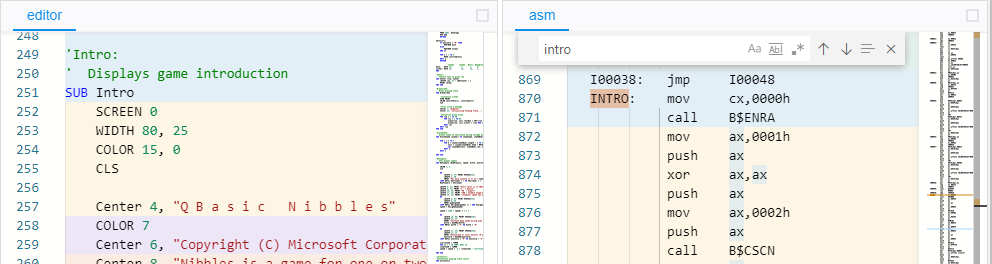
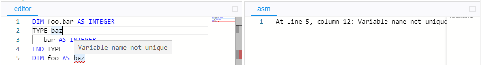
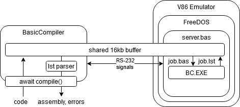

# BasBolt

## Overview
BasBolt is an in-browser compiler explorer for QuickBASIC. It automatically
compiles code into 16-bit assembly using Microsoft BASIC Compiler as you type, 
and integrates the results into the editor.

Shows generated assembly, colored to identify source code regions


As well as marks errors in the source code:


## How It Works
The editor keeps a [V86 emulator](https://copy.sh/v86) instance in the background, running a small server on FreeDOS to facilitate communication. The server written in QuickBASIC (of course). 

Whenever the code in the editor changes:
 1. The editor transfers the source code to the server
 2. The server saves the source code to a file
 3. The server invokes BC.EXE (Microsoft BASIC Compiler) to compile
 4. The server transfers the listing file output to the editor
 5. The editor parses the listing file and annotates the source code

 ### Transferring Files

V86 doesn't have an API to access FAT16 disks, but file transfer is made possible using a shared memory buffer. 



Since 16-bit real mode DOS doesn't concern itself about any silly nonsense like virtual memory protection, The server can just allocate a buffer, do a little arithmetic with the segment and offset, and write the physical address to the console:
```basic
CONST buffersize& = 16384
DIM SHARED buffer AS STRING * 16384

segment& = VARSEG(buffer)
IF segment& < 0 THEN segment& = 1 - segment&
pointer& = VARPTR(buffer)
IF pointer& < 0 THEN pointer& = 1 - pointer&
bufferaddr& = segment& * 16 + pointer&

PRINT USING "(buffer&, size&) "; STR$(bufferaddr&); STR$(buffersize&);
```
Which prints something like this, redirected to COM1:
``` 
(buffer 123456, size: 16384)
```

The editor reads the pointer using the V86's serial API. V86 is written in surprisingly legible Javascript, and allocates emulated system RAM in a [Uint8Array](https://developer.mozilla.org/en-US/docs/Web/JavaScript/Reference/Global_Objects/Uint8Array). By hacking V86 to expose that array, and taking a subarray of that array starting at the buffer address...

```javascript
buffer = emulator.get_mem().subarray(address, address + size)
```
...the editor can transfer data directly into the server's buffer. 16KB blocks are written at one time, sending a byte over COM1 to signal the data is ready to copied, and waiting for a byte over COM1 to signal that the server is ready for more data. In formal CS literature, this transaction is called a podunk direct memory access (PDMA) transfer.

### Compiling 

To compile, the server invokes the `SHELL` command to run BC.EXE. Passing with the /A option generates a .lst file that includes each line of source, followed by the assembly for that line and any errors. 
```
BC.EXE /A /O JOB.BAS JOB.OBJ JOB.LST
```

job.bas:
```basic
PRIN "HELLO WORLD"
```

job.lst:
```txt
                                                                      PAGE   1
                                                                      12 Dec 20
                                                                      16:34:29
Offset  Data    Source Line           Microsoft (R) BASIC Compiler Version 7.10

 0030   0006    PRIN "HELLO WORLD"
                     ^ Equal sign missing
 0030    **        I00002:   call    B$CENP
 0035   0006    

46074 Bytes Available
45976 Bytes Free

    0 Warning Error(s)
    1 Severe  Error(s)
```
_yes, it's paginated and formatted for your dot matrix printer_

Errors and assembly don't include any explicit line numbers and columns. But by counting lines of code, and spaces between the start of the line and the "^" for errors, the line and column of errors can be determined. The listing file is parsed using a combination of regular expressions and a simple state machine.

The assembly mappings in the listing files are not as fine-grained as the ones generated by modern compilers. It appears to only associate entire blocks of source code between branches and labels, with blocks of assembly. But it's still enough to give you a near rough idea of what source code becomes what assembly.

## Building 

### 1. Obtaining BIOS Images
For X86 emulation with V86, a BIOS image is required to function:
 * [SeaBIOS](https://www.seabios.org/downloads/) is used as the bios
 * [Bochs VGABios](http://www.nongnu.org/vgabios/#DOWNLOAD) is used as the VGA bios

### 2. Setting Up The Boot Disk
Get a FreeDOS boot disk from the [official website](http://www.freedos.org/download/). It is not distributed here because its license (GPLv2) is incompatible with this project's (MIT). 

Add the following command to `AUTOEXEC.BAT` to launch the server, and redirect its input and output to COM1:
```
D:\SERVER.EXE<COM1>COM1
```

### 3. Setting Up The CD-ROM Image
 `SERVER.EXE` is the server and its source can be found in this repository. It can be built with QuickBASIC 4.5 using the following commands in either DosBox or FreeDOS:
  ```
  BC.EXE /O SERVER.BAS SERVER.OBJ NUL
  LINK.EXE SERVER.OBJ,SERVER.EXE,NUL,BCOM45.LIB,NUL
  ```

`basbolt.iso` is a CD-ROM with:
 * BC.EXE and BCOM45.LIB included at `D:\QB45`. 
 * SERVER.EXE included at `D:\`
 
 ISO creation software is available on all major platforms:
 * [Linux instructions](https://askubuntu.com/questions/136165/how-to-create-an-iso-image-from-a-bunch-of-files-on-the-file-system)
 * [Infrarecorder (Windows)](http://infrarecorder.org/)
 * [MacOS instructions](https://support.apple.com/guide/disk-utility/create-a-disk-image-dskutl11888/mac)

DISCLAIMER: QuickBASIC is a registered trademark of Microsoft and the original software is protected under copyright. Distribute at your own risk. I consider this project to be fair use under US law because:
 * It is transformative, educational, historical, and non-commercial
 * It only uses a small portion of the copyrighted work (the compiler)
 * QuickBASIC has not been sold or supported for several decades, and its trademark is not in active use
 * Microsoft's equivalent current product, [Roslyn](https://github.com/dotnet/roslyn), is free and open source under an MIT license
 
 If you are from Microsoft's legal department and object to this interpretation, please send me a threatening legal-sounding letter and I will be in contact to fold like a wet paper bag.

Place `basbolt.iso`, `seabios.bin`, and `vgabios.bin` under `/images`, 

### 4. Building

The project is packaged with npm and webpack, and can be built using the following commands:
```
npm install
npm run buildRelease
```
If the bundling is successful, the contents of `/dist` can be deployed to any webserver. 

## Roadmap
This project is currently a fun tech demo that started as a joke, and was written as a way for me to practice writing a semi-complex project using React Hooks. 

But it would be neat to make something like a tweakable sandbox for showcasing old Q(uick)?BASIC games and demos. Eventual features would include 

* Linking
* Running
* Multiple sources
* Non-source files
* Multiple compilers (QB 1-4, PDS 7.1, VBDOS 1.0, etc)
* In-app help, etc


## Contributing
Are you of sound mind? And want to contribute? Welcome to that very narrow middle of that Venn diagram, friend. I would happily review issues or pull requests.